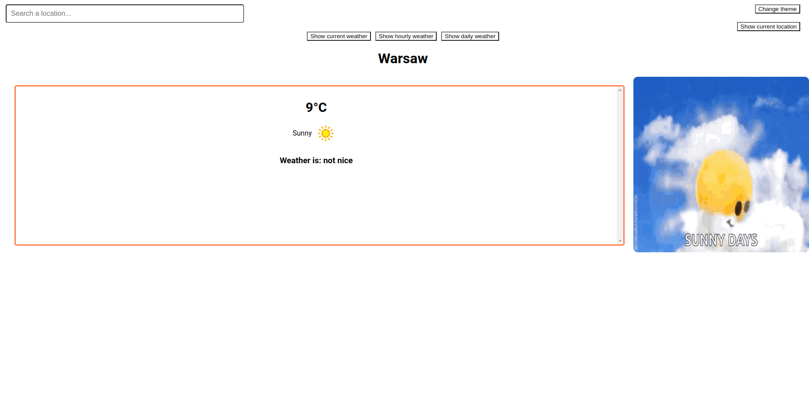
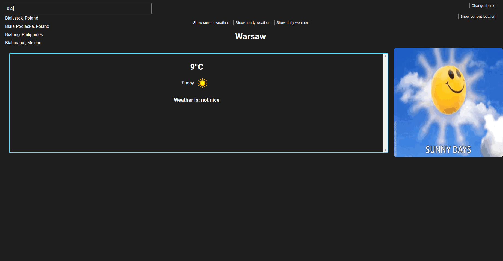
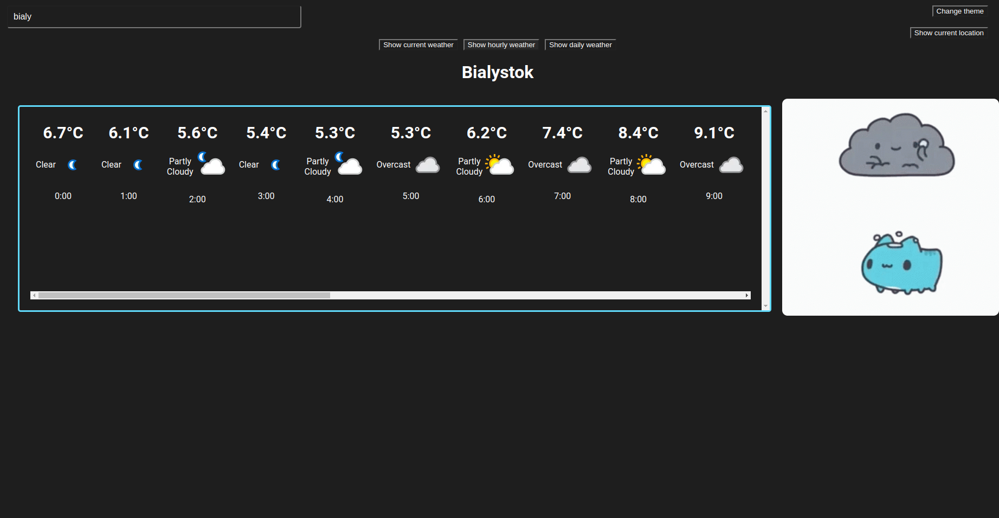
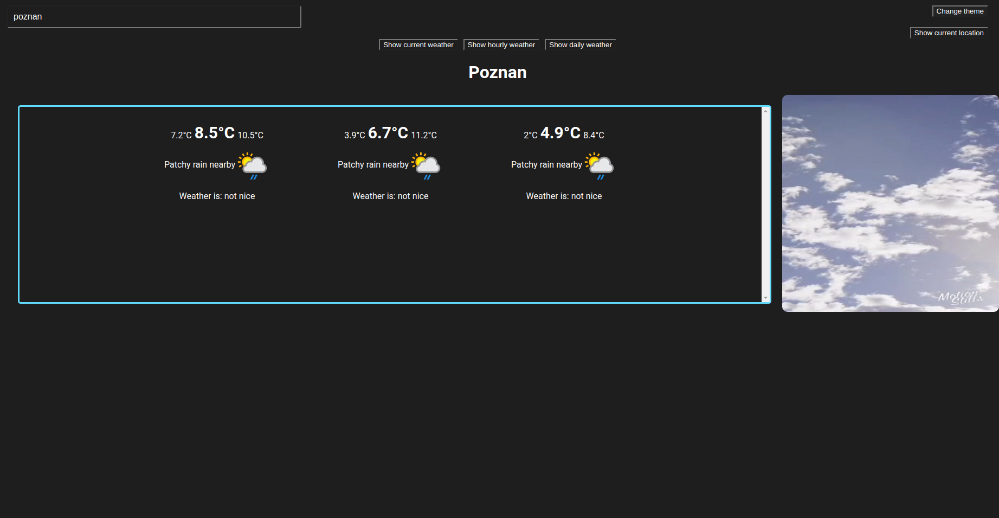

Projekt stworzony w ramach przedmiotu Języki i narzędzia programowania II na Uniwersytecie Warszawskim.

## Opis projektu
Aplikacja webowa, która umożliwia użytkownikowi wyświetlanie informacji o pogodzie dla wybranego miasta. Aplikacja korzysta z zewnętrznego API, aby pobierać dane pogodowe oraz obrazy związane z warunkami pogodowymi.

Możliwości wyświetlania aktualnej, godzinowej oraz prognozy pogody na 3 dni. Użytkownik może również wyświetlić informacje o pogodzie dla swojej lokalizacji.

## Korzystanie z aplikacji
Po zainstalowaniu niezbędnych rzeczy uruchamiamy program następującą komnedą:
```shell
npm start
```







